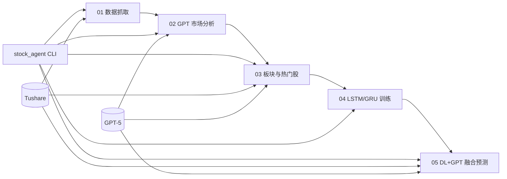

# EquityAgent · A股智能分析与预测 Agent

> 基于课程 Agent 框架**二次开发**的 A 股分析流水线：Tushare 行情 + GPT 解读 + LSTM/GRU 深度学习。

[](https://www.python.org/)
专为 A 股打造的金融分析智能助手，一站式整合数据采集、AI 解析与深度学习预测，覆盖宏观市场研判与板块挖掘、个股走势分析。

---

## 架构流程



---

## 二次开发说明

本项目在课程提供的多步骤 Agent 骨架上完成以下改动（与简历描述一致）：

| 改动项 | 说明 |
|--------|------|
| **LSTM+GRU 混合（04）** | 新增 `GRULSTMModel`，LSTM 与 GRU 并行编码，默认 **70% LSTM + 30% GRU** 融合；CLI 支持 `--model-type grulstm` |
| **DL+GPT 融合（05）** | 深度学习概率 **70%** + GPT JSON 输出 **30%** 加权融合（与上项为不同模块的两套 7:3） |
| **运行自动清数（01）** | 每次抓取前删除 `a_share_out/` 内 8 类旧文件，避免多交易日数据混用 |
| **GPT-5 分析链路** | 打通 02/03/05 大模型调用，完成市场报告、板块解读与融合预测 |
| **网关配置** | 通过 `.env` 配置 `TUSHARE_DATAAPI_URL` 与 `AZURE_OPENAI_DEPLOYMENT`，无需改业务代码即可切换数据源与模型 |

---

## 快速开始

### 1. 安装依赖

```bash
pip install -r requirements.txt
```

### 2. 配置环境变量

```bash
cp env.example .env
```

编辑 `.env`，至少填写：

```env
TUSHARE_TOKEN=your_tushare_token
TUSHARE_DATAAPI_URL=http://your-tushare-gateway:port

AZURE_OPENAI_ENDPOINT=https://your-endpoint.example.com
AZURE_OPENAI_API_KEY=your_api_key
AZURE_OPENAI_DEPLOYMENT=gpt-5.4
AZURE_OPENAI_API_VERSION=2024-12-01-preview
```

> **安全提示**：`.env` 含敏感信息，已加入 `.gitignore`，请勿提交到仓库。

### 3. 运行

```bash
# 默认执行 01,02,03
python -m stock_agent

# 指定日期（仅影响 01 抓数）
python -m stock_agent --date 20260707

# 分步执行
python -m stock_agent --steps 01,02,03

# LSTM+GRU 混合批量训练（04）
python -m stock_agent --steps 04 --model-type grulstm

# 单股 DL+GPT 融合预测（05）
python -m stock_agent --steps 05 --stock 688206.SH
```

Windows 若 05 步骤 emoji 报错，可先执行：

```powershell
$env:PYTHONIOENCODING='utf-8'
```

---

## 五步流水线

| 步骤 | 脚本 | 功能 |
|------|------|------|
| 01 | `01_data_fetch.py` | 全 A 日行情、三大指数、市场情绪；运行前自动清理旧数据 |
| 02 | `02_analysis.py` | 调用 GPT 生成八维度市场分析报告 → `a_share_out/` |
| 03 | `03_stock_prediction.py` | Top-5 板块 × 25 热门股，6 维因子评分 + GPT 解读 → `market_analysis/` |
| 04 | `04_lstm_gru_prediction_enhanced.py` | LSTM / GRU / **LSTM+GRU 混合** 三分类时序训练 |
| 05 | `05_hybrid_prediction.py` | **LSTM 深度学习 + GPT JSON** 按 7:3 融合单股涨跌震荡预测 → `hybrid_predictions/` |

统一入口：`stock_agent/cli.py`，通过 `a_share_out/_latest_trade_date.txt` 保证 02/03 与 01 交易日一致。

---

## 运行结果示例

实测交易日 `20260707` 节选见 [docs/sample_output.md](docs/sample_output.md)。

也可打开 [proof_materials/运行结果证明材料.html](proof_materials/运行结果证明材料.html) 查看排版后的证明卡片（数据来自真实跑通结果）。

---

## 项目结构

```
EquityAgent/
├── stock_agent/          # 统一 CLI 入口
│   ├── cli.py
│   └── __main__.py
├── 01_data_fetch.py
├── 02_analysis.py
├── 03_stock_prediction.py
├── 04_lstm_gru_prediction_enhanced.py
├── 05_hybrid_prediction.py
├── openai_client.py
├── tushare_client.py
├── env.example
├── requirements.txt
├── docs/
│   └── sample_output.md
└── proof_materials/
    └── 运行结果证明材料.html
```

运行后本地生成（已 gitignore，不提交）：

- `a_share_out/` — 01、02 输出
- `market_analysis/` — 03 输出
- `hybrid_predictions/` — 05 输出

---

## GitHub Topics（建议在仓库 About 填写）

```
python, tushare, llm, gpt, lstm, gru, stock-analysis, agent, a-share, quantitative-finance
```

---

## 免责声明

本项目**仅供学习与研究**，不构成任何投资建议。预测结果存在分歧与不确定性，请勿用于实盘交易决策。
